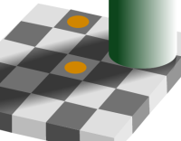
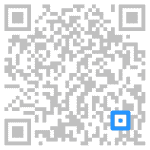
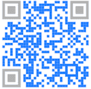

# 09.10.2023

- [09.10.2023](#09102023)
  - [Coding](#coding)
    - [Resources](#resources)
    - [Colors and their coding](#colors-and-their-coding)
      - [RGB](#rgb)
        - [Silver, gold and metallic colors](#silver-gold-and-metallic-colors)
      - [CMYK](#cmyk)
      - [Subjective perception](#subjective-perception)
    - [QR-Code](#qr-code)
      - [Elements of a QR Code](#elements-of-a-qr-code)
        - [Positioning marking](#positioning-marking)
        - [Alignment marking](#alignment-marking)
        - [Timing pattern](#timing-pattern)
        - [Quiet zone](#quiet-zone)
        - [Version information](#version-information)
        - [Format information](#format-information)
        - [Data and error correction module](#data-and-error-correction-module)
    - [Facial action coding system](#facial-action-coding-system)
    - [URL coding](#url-coding)
      - [Parts of an url](#parts-of-an-url)
      - [URL encoding](#url-encoding)
      - [IPFS](#ipfs)
    - [Barcodes](#barcodes)


## Coding

### Resources

- [animalgenome - URL encoding](https://www.animalgenome.org/community/angenmap/URLEncoding.html)

### Colors and their coding

#### RGB

Humans are not capable of perceiving the whole color spectrum. We have 3 cone cells for perception: R(red)G(green)B(blue). These three colors can be added to achieve different colors. This is done in the RGB color model. For Monitors, each pixel contains three subpixel(red, green and blue). Fo taking photos, the photosensor also captures three images for each color(red, green and blue).
For storing the values of each color, usually 8 bit are used. This allows for a value from 0 to 255. For red, 0 would be completely black wheres as 255 would be the maximum intensity of red. By taking up 8 bit for each color, 24 bit are used to store a color.
To create a shorter notation, the values can also be written in the hexadecimal system.
The maxium number of combinations is 256 * 256 * 256 = 16'777'216.
The rgb color system is also limited and is not suitable for every use case. E.g. very bright colors.

There are also different rgb spectrums: 

- sRGB
- Adobe RGB 1998
- ProPhoto RGB

_Notations:_

- rgb
  - E.g. rgb(255,230,23) or with an alpha value rgba(243,12,21,0.8)
- hex
  - E.g. #ff34ff

##### Silver, gold and metallic colors

Even though, there are rgb colors for silver(#C0C0C0) and gold(#ffd700), they don't look like silver or gold when displayed as a large area. Materials like silver and gold and other metallic colors require surface effects to look realistic. Normally this is done with reflections.

#### CMYK

The rgb color system is not suitable for printing as it is additive and works when the background is dark.
For printing, the surface/background is normally white and it makes sense to use a different color system to get accurate colors. The CMYK color system is subtractive.
To print with CMYK, first the cyan part of the image is printed, then the magenta, then yellow and finally the key, meaning the black part.

#### Subjective perception

The preceived color is not only dependent on the color intensity. It relates also to the surrounding colors.. Therefore a color with the same color values can appear brighter or less brighter depending on its location.



### QR-Code

QR = Quick response

#### Elements of a QR Code

QR Codes may appear to be random but they are in fact slightly different. Although QR Codes can be customized, the shape of the QR Code must always be square. There are 7 different elements in a QR Code.

##### Positioning marking


This indicates the direction in which the QR Code is printed. Even if your camera is at an angle, you will still be able to scan the QR Code.

##### Alignment marking



If the QR Code is too large, say on a billboard, this helps to orient the image.

##### Timing pattern


This helps the QR Code scanner determine how large the data matrix is in the QR Code.

##### Quiet zone


This is the most crucial part of the QR Code. This helps the QR Code scanner differentiate the QR code from the surroundings.

##### Version information


There are over 40 different QR Code versions. These are markers present in a QR Code that specifies the one that is being used. The most common ones are versions 1 to 7.

##### Format information


The format pattern consists of information about the error tolerance that makes it easier to scan the code.

##### Data and error correction module



The central part of a QR Code consisting of black and white modules is where the code stores the data and has blank space surrounding them to allow up to 30% of the code to be damaged.

### Facial action coding system
The Facial Action Coding System, or short FACS, is a system to track individual muscle movements in the face and put them into so called Action Units. E.g. action unit 45 is used for blinking which involves relaxing and contracting the related muscles. There are other action units like 54, which refer to moving your head down. To describe emotions, we can combine these action units and can express emotions like happiness, where we combine action units 6 and 12.

### URL coding

#### Parts of an url

- protocol
  - E.g. http, https
- domain
  - E.g. www.google.com
    - .com is the top-level-domain
    - google is the domain
  - www is the subdomain
- path
  - E.g. /path/to/image
- query string
  - ?id=1&search=test
- fragment
  - E.g. #section1

#### URL encoding

URL encoding is the process of converting a string to a valid URL format. A valid URL format only allows specific characters. If the string contains characters that aren't allowed, these characters will be converted/encoded so that they can be used in an URL. The receiving end can then decode the URL and will have the correct characters.

#### IPFS

IPFS (InterPlanetary File System) is a decentralized file system of the Web3.
An IPFS address consists essentially of a CID (Content Identifier), e.g. Qme7ss3ARVgxv6rXqVPiikMJ8u2NLgmgszg13pYrDKEoiu.

There are three ways to retrieve an IPFS document. Either directly ```ipfs://<CID>``` and ```dweb://<CID>```, or via a gateway ```https://ipfs.io/ipfs/<CID>``` or via a peer ```ipns://<peer ID>/<path>```

### Barcodes

A bar code is a onedimensional coding system. It is machine readable. Barcodes represent data by varying the widths, spacings and sizes of parallel lines.